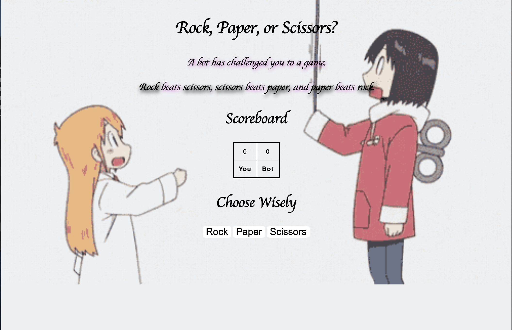

<h1>Rock Paper Scissors</h1>
<strong>Goal: </strong>Create a simple game of Rock, Paper, Scissors using Javascript</strong>



Create a game of Rock Paper Scissors, which includes three buttons that correspond to the respective choices for the game.
Make a scoreboard which keeps track of the "Players" wins, and of the "Bots" wins.

<strong>Link: </strong>https://thirsty-goldwasser-1732b4.netlify.app


<strong>How It's Made</strong>

I started out this project by first making the outlines for where I wanted my asset to be. 
In order to make the game work I used the	``` Math.Random``` function to make the bot's decision randomly selected when the player selected their choice,
and had the three buttons correspond to an item called either "Rock", "Paper", or "Scissors".

Based on the rules given in the JavaScript would determine who came out to be the "winner"

Like this,
```
if(
		(botsWeapon=="scissors" && playersWeapon=="paper") ||
		(botsWeapon=="paper" && playersWeapon=="rock") ||
		(botsWeapon=="rock" && playersWeapon=="scissors")
		)
 ```
 
 I then finished up the looks of the project with CSS.
 
 <strong>Lessons Learned</strong>

In my journey of programming I am continuously learning that there are wonders of things you can do even with just a single language such 
as JavaScript. I understand that this is a base understanding on how to create a game against the "computer entity". 
Once I saw the Math.random function was how RNG was made, I began to understand a bit more on perhaps how game developers create
projects which involve RNG. Now I know they definitely use different programming languages for more advanced games, but 
understanding the concept of the code, I feel, and being able to associate the execution of what the code does is a good start.
